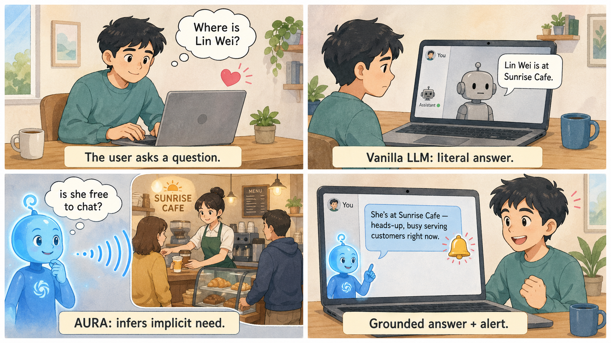
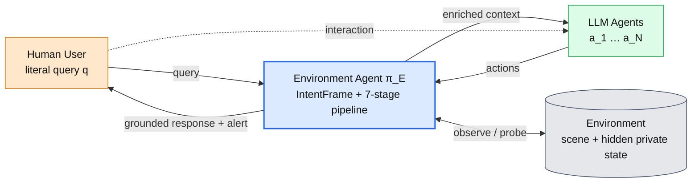
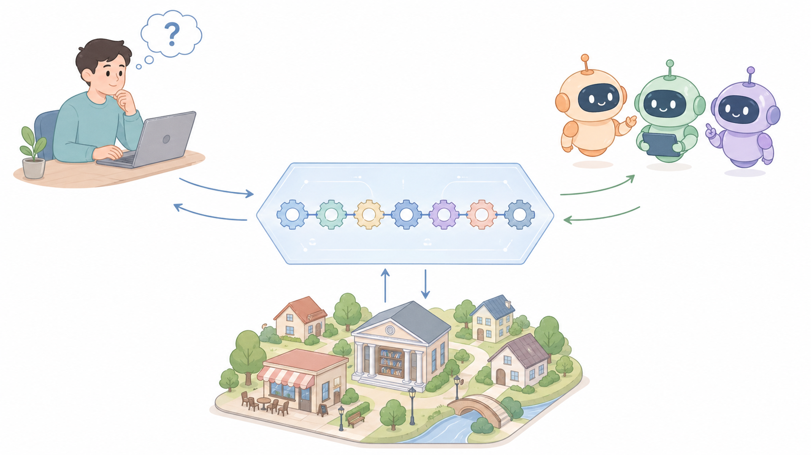
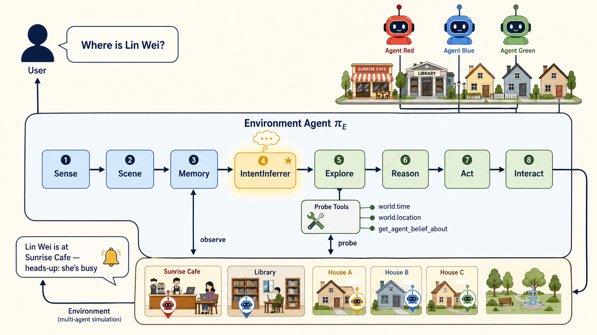
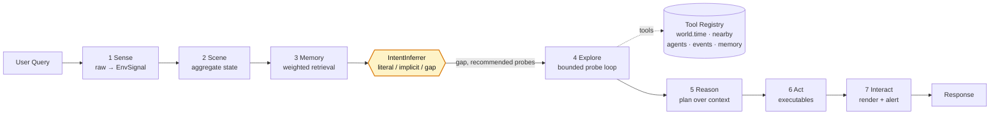
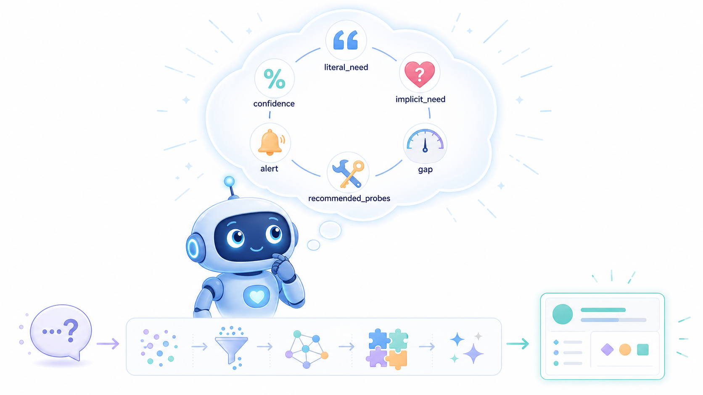
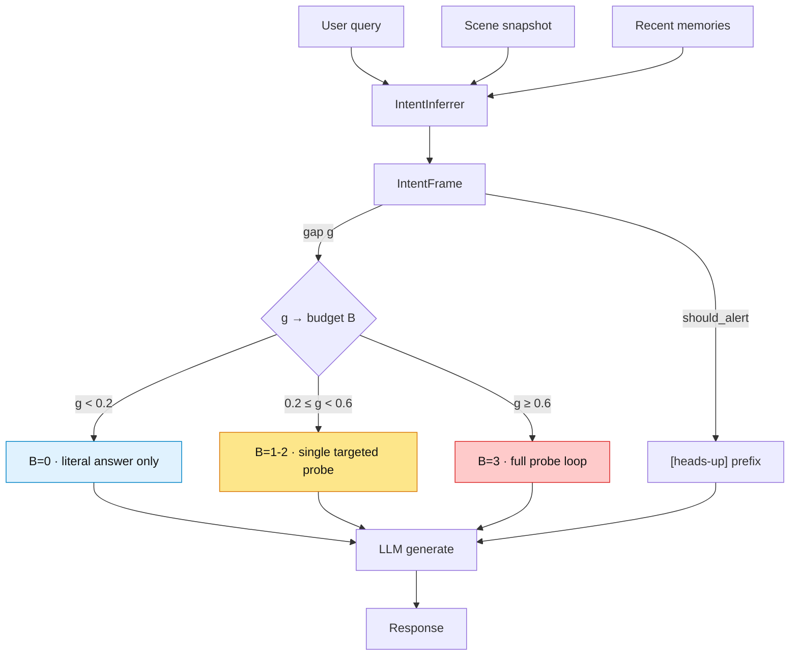
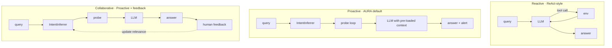

# AURA: Intent-Directed Probing for Implicit-Need Surfacing in Situated LLM Agents

[](https://www.python.org/downloads/)
[](LICENSE)

<p align="center">
  
</p>

<p align="center">
  <em>AURATown — the 5-agent social simulation testbed where AURA's mechanisms are evaluated.<br/>
  Technical 60×60 grid map with named coordinates: see <a href="docs/assets/auratown-map.svg">auratown-map.svg</a>.</em>
</p>

**AURA** is an *environment agent* that bridges the alignment gap between
users and LLM-driven AI agents. Instead of passively answering literal
queries, AURA infers the user's **implicit information need**, decides
how much environmental probing that need warrants, and pre-loads grounded
context *before* reasoning begins.

The defining mechanism is an **`IntentFrame`** — a learned theory-of-mind
structure that models the gap between what the user *asked* and what
the user *wants* — on top of a deterministic `Perceive → Scene → Memory →
Reason` pipeline.

---

## The Problem

Asking *"where is Lin Wei?"* often means *"is she free to chat?"* A
reactive LLM agent answers the surface question; the user's real need
never surfaces. AURA addresses this alignment gap at the architectural
level.

<p align="center">
  
</p>

<p align="center">
  <em>What AURA does in 30 seconds: it doesn't just answer the literal question — it infers the user's implicit need, probes the environment, and surfaces what actually matters with an explicit heads-up.</em>
</p>



AURA sits in the middle of the Human–Agent–Environment triangle,
mediating context flow in both directions.

<p align="center">
  
</p>

---

## The Architecture

<p align="center">
  
</p>

An **eight-stage pipeline**. The first three stages (Sense, Scene,
Memory) build grounded context deterministically; the
**`IntentInferrer`** (★ in the figure) is the point at which the LLM
takes over control flow (per-query probe budget, tool selection,
alerting). Explore, Reason, Act, Interact then run on the enriched
context.



**Deterministic shape, agentic content.** Stages 1–3 are code-determined
so context assembly is predictable. Stages 4, 7 are LLM-directed via
the `IntentFrame` so per-query judgment is local where it matters.

---

## IntentFrame: Modeling the Implicit Need

<p align="center">
  
</p>

Each query produces an `IntentFrame`:

```python
IntentFrame(
    literal_need       = "Lin Wei's current location",
    implicit_need      = ["is Lin Wei available to chat?", "mood"],
    gap                = 0.5,                               # [0, 1]
    recommended_probes = ["get_nearby_agents", "get_agent_plan"],
    should_alert       = True,
    confidence         = 0.8,
    rationale          = "location query; real need is social availability",
)
```

The `gap` drives the probe budget; `recommended_probes` is whitelisted
against the live tool registry; `should_alert` opts in to a
`[heads-up]` prefix on the response.



The budget map is a **ceiling**, not a target — the LLM often stops
short of it when a single well-targeted probe has already returned
actionable information. See `aura.intent.LLMIntentInferrer` for the
prompt calibration and `aura.intent.HeuristicIntentInferrer` for the
deterministic fallback.

---

## Interaction Paradigms

AURA cleanly separates three information-flow regimes, parameterised by
a single `ParadigmConfig`:



Reactive spends the tool budget *during* reasoning. Proactive spends it
*before* reasoning, with intent inference directing where to look.
Collaborative closes the loop with human attention-budget signals.

---

## Highlights

- **IntentFrame** — learned literal/implicit gap estimation that routes
  per-query probe budget, tool preference, and proactive alerting.
- **7-stage pluggable pipeline** — Sense · Scene · Memory · Reason ·
  Explore · Act · Interact, every stage swappable via the backend
  registry (`default`, `llm`, `bmam`, `model`).
- **Bounded probe loop** — pre-reasoning tool-call loop with a hard
  ceiling (`explore_max_steps`) and domain-contextualised tool set.
- **Proactive context engine** — environment probes (system, git,
  docker, filesystem, network, process) push relevant signals to the
  agent before it asks.
- **Runtime safety guard** — 5-level intervention (Observe → Hint →
  Suggest → Constrain → Redirect) detects loops, stagnation, goal
  drift.
- **Workflow optimisation** — `WorkflowEngine` reuses successful tool
  sequences; `StrategyAuditor` retires ineffective strategies.
- **Second-order ToM probe** — `get_agent_belief_about` tool lets one
  agent query another agent's beliefs about a third, for
  false-belief-style reasoning.

---

## Installation

```bash
# Core (zero external dependencies, runs on stubs)
pip install -e .

# With LLM backend + server support
pip install -e ".[server]"

# Development (tests, linting, type checking)
pip install -e ".[dev]"
```

## Quick Start

### CLI

```bash
# Direct environment understanding
aura "office, 2 people, projector on" --query "summarize environment"

# With pre-reasoning probing
aura "meeting room" --query "any project files?" --probe --max-steps 2

# Restrict which tools the explorer may call
aura "lab" --query "check GPU status" --probe --allow-tool "system.*"
```

### Python API

```python
from aura import AURAAgent, AURAConfig
from aura.intent import LLMIntentInferrer

config = AURAConfig(
    backend="llm",
    llm_api_key="sk-...",
    llm_model="gpt-4o-mini",
    explore_enabled=True,
    explore_max_steps=3,
    intent_backend="llm",     # or "heuristic" for deterministic
    guard_enabled=True,
)

agent = AURAAgent(config)
result = agent.step(
    raw_input="Sunrise Cafe, 10:15 AM. Lin Wei at counter.",
    query="where is Lin Wei?",
)
print(result.text)
# → Lin Wei is at the Sunrise Cafe counter.
#   [heads-up] she is currently busy serving customers — you may want
#   to wait until she has a free moment before starting a long chat.
```

### Server

```bash
aura-server --host 0.0.0.0 --port 8000
# WebSocket + HTTP, streaming responses, transparency metadata
```

---

## Backends

| Backend   | What it is                                   | Deps        |
|-----------|----------------------------------------------|-------------|
| `default` | Stub implementations, no external calls      | None        |
| `llm`     | OpenAI-compatible LLM for all stages         | API key     |
| `bmam`    | Bridge to [BMAM](https://github.com/) five-brain-region system | BMAM server |
| `model`   | Neural plasticity memory layer               | API key     |

Select with `AURAConfig(backend=...)` or the `--backend` CLI flag.

## Configuration (excerpt)

```python
AURAConfig(
    # Backend
    backend="llm",                    # default | llm | bmam | model
    llm_model="gpt-4o-mini",

    # Intent (new — the ToM stage)
    intent_enabled=True,
    intent_backend="llm",             # llm | heuristic
    intent_gap_to_budget=(0.2, 0.4, 0.6, 0.8),

    # Exploration
    explore_enabled=True,
    explore_max_steps=3,
    smart_planner=True,

    # Proactive engine (separate from Explore)
    proactive_enabled=True,
    proactive_poll_interval=10.0,
    proactive_relevance_threshold=0.4,

    # Safety
    guard_enabled=True,
    guard_window=8,
    guard_threshold=0.7,

    # Workflow optimisation
    workflow_enabled=True,
    workflow_reuse_rate=0.6,
)
```

---

## Project Structure

```
src/aura/
├── core.py              # AURAAgent — main orchestrator
├── types.py             # IntentFrame, SceneState, MemoryItem
├── intent.py            # IntentInferrer (Heuristic + LLM)  ← the ToM stage
├── sense.py             # Environment input adapter
├── scene.py             # Scene state building
├── memory.py            # Semantic memory (TF-IDF)
├── reason.py            # Reasoning interface
├── act.py               # Action interface
├── interact.py          # Interaction interface (+ alert rendering)
├── explore.py           # Bounded probe loop
├── tools.py             # Tool registry (incl. get_agent_belief_about)
├── smart_planner.py     # Context-aware probe planner
├── guard.py             # Runtime safety (5-level intervention)
├── workflow.py          # WorkflowEngine (reuse + synthesis)
├── auditor.py           # StrategyAuditor (retire ineffective ones)
├── feedback.py          # Conditional feedback store
├── llm.py               # OpenAI-compatible engine
├── backend.py           # Plugin backend registry
├── defaults/            # LLM-based default implementations
├── adapters/            # External bridges (BMAM, model)
├── paradigm/            # Reactive / Proactive / Collaborative
├── proactive/           # Proactive context engine + probes
├── probes/              # Environment sensors (system, git, docker, …)
├── views/               # Specialized agent personas
├── eval/                # Benchmarking & metrics
├── trajectory/          # Training-data collection
└── server/              # FastAPI server mode
```

## Testing

```bash
pytest tests/                       # full suite
pytest tests/test_core_integration.py
pytest tests/test_intent.py         # IntentInferrer
pytest tests/ -m "not slow"
```

## Experiments

Research validation scripts in `experiments/`:

```bash
python -m experiments.run_paradigm_comparison   # reactive vs proactive vs collab
python -m experiments.run_ablation              # per-component ablation
python -m experiments.run_scalability           # N-agent scaling
python -m experiments.run_feedback_convergence  # collaborative loop
```

A companion multi-agent testbed (**AURATown**, 5 agents, social
simulation with hidden private state) and an implicit-intent benchmark
(25 queries × 5 subcategories) live in the sibling evaluation project.

## License

[MIT](LICENSE)
